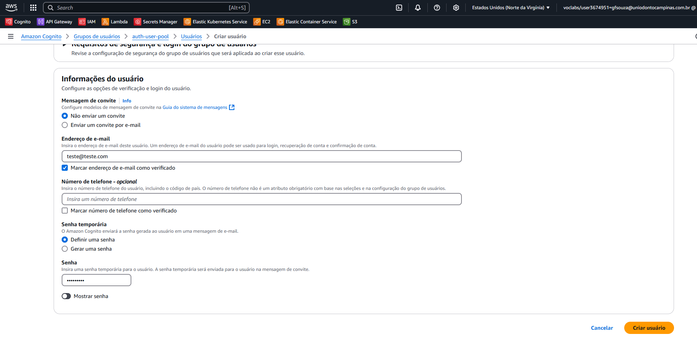
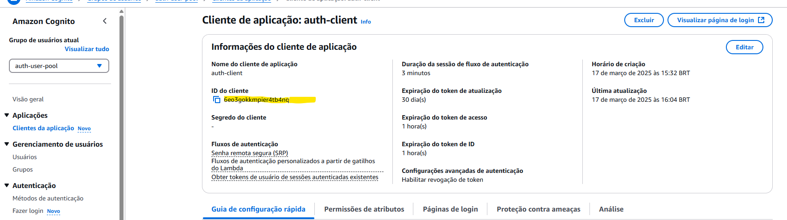
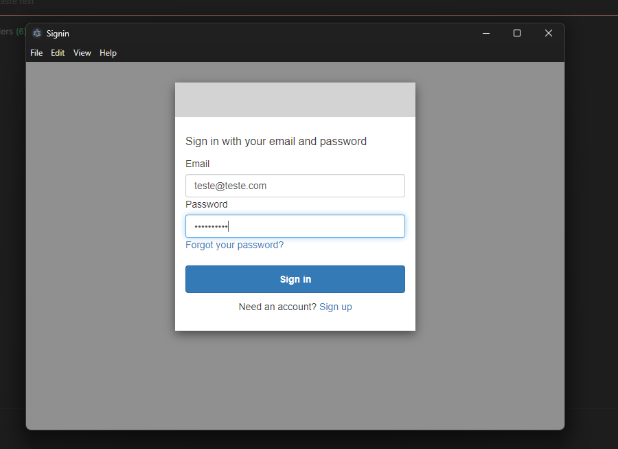

# AuthCognito

Este projeto implementa uma API protegida usando AWS Cognito e um Lambda Authorizer.

## Pré-requisitos

- AWS CLI configurado
- Terraform instalado
- Python 3.8 ou superior

## Arquivos Principais

### Lambda Authorizer

O arquivo [`lambda_authorizer.py`](lambda/lambda_authorizer.py) contém o código do Lambda Authorizer que valida o token JWT.

### Terraform

- [`api_gateway.tf`](terraform/api_gateway.tf): Configura o API Gateway e o Lambda Authorizer.
- [`cognito.tf`](terraform/cognito.tf): Configura o User Pool do Cognito.
- [`data.tf`](terraform/data.tf): Define o recurso de dados IAM Role.
- [`lambda.tf`](terraform/lambda.tf): Configura a função Lambda.
- [`permissions.tf`](terraform/permissions.tf): Configura as permissões IAM para a função Lambda.
- [`provider.tf`](terraform/provider.tf): Configura o provedor AWS.
- [`variables.tf`](terraform/variables.tf): Define as variáveis usadas no Terraform.

## Configuração

### Terraform

1. Navegue até o diretório `terraform`:
    ```sh
    cd terraform
    ```

2. Inicialize o Terraform:
    ```sh
    terraform init
    ```

3. Crie a configuração do Terraform:
    ```sh
    terraform plan
    ```

4. Aplique a configuração do Terraform:
    ```sh
    terraform apply
    ```
    Nesse passo, no terminal você deve escrever "yes" para confirmar as ações.

### AWS

1. Acesse a página do Cognito e entre no auth-user-pool.
2. No lado esquerdo da tela, acesse "Usuários" e crie um usuário de teste.

    

## Uso

Após a configuração, você pode fazer chamadas para a API.

1. Acesse o Postman e crie uma requisição GET com a URL da API Gateway. Para pegar a URL desse endpoint, acesse a AWS e siga:
    1.1. API Gateway > APIs > `auth-api`.
    1.2. Dentro do `auth-api`, clique em Estágios. Copie o "Invocar URL"
2. Em Authorization, selecione OAuth 2.0.
3. Preencha os campos (conforme o `variables.tf`):
    - **CallBack URL**: `https://auth-vidsnap-domain-example.com/callback`
    - **Auth URL**: `https://auth-vidsnap-domain-example.auth.us-east-1.amazoncognito.com/oauth2/authorize`
    - **Access Token URL**: `https://auth-vidsnap-domain-example.auth.us-east-1.amazoncognito.com/oauth2/token`
    - **Client ID**: Dentro do Cognito, acesse "auth-user-pool" > lado esquerdo da tela em "Clientes da aplicação" e clique no auth-client. Nessa tela, copie o ID do cliente.
    - **Client Secret**: Na mesma tela anterior do Cognito, copie o segredo do cliente.
    

4. Clique em "Get New Access Token".
5. Se tudo foi configurado corretamente, será aberta uma página onde deve ser preenchido o e-mail e senha configurados no passo 2 da configuração AWS.
    

Certifique-se de incluir o token JWT no cabeçalho `Authorization` da solicitação.

## Licença

Este projeto está licenciado sob a [MIT License](LICENSE).